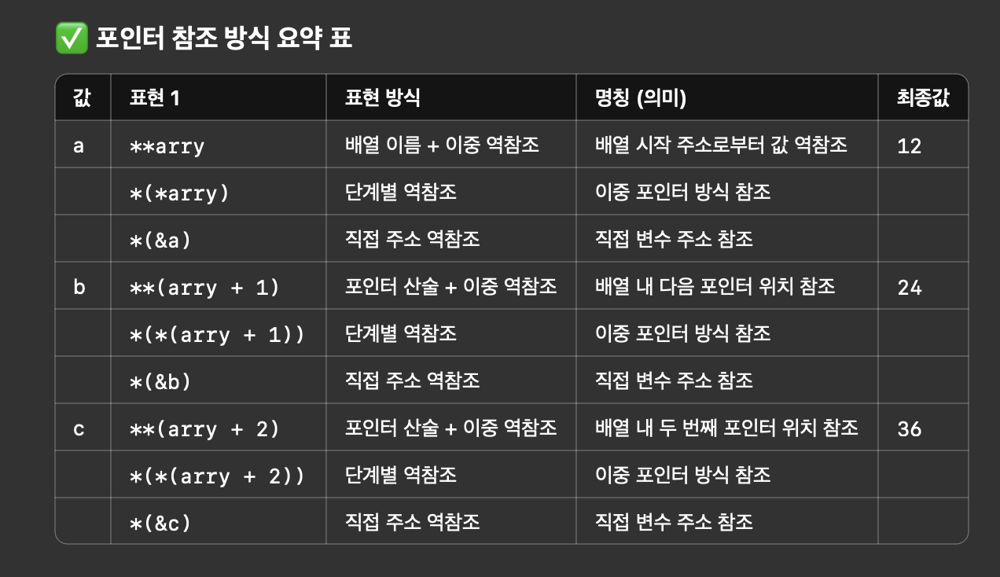

# gcc & IDE

-  CLion이나 IntelliJ 같은 **IDE(통합 개발 환경)**에서는 우리가 수동으로 해야 하는 과정들을 자동으로 백그라운드에서 처리

```
🛠️ 우리가 직접 하는 방식 (터미널)
	1.	gcc test.c -o test → 컴파일
	2.	./test → 실행
```

```
🚀 IDE에서의 방식 (자동화)

예: CLion (C/C++)
	1.	작성한 코드 저장
	2.	▶️ Run 버튼 클릭
	3.	CLion은 내부적으로 이런 작업을 자동으로 합니다:
	•	gcc 또는 clang으로 컴파일
	•	빌드 디렉토리(cmake-build-debug 같은 곳)에 바이너리 생성
	•	자동으로 실행 파일 실행
	•	콘솔에 결과 출력

사실상 Run 버튼은 gcc test.c -o test && ./test 같은 명령을 대신 실행
```

```
예: IntelliJ (Java)
	1.	Java 파일을 저장하고 ▶️ 버튼을 누르면,
	2.	내부적으로 이렇게 처리됩니다:
	•	javac Main.java → .class 파일 생성
	•	java Main → 실행

이 모든 과정은 눈에 안 보이게 백그라운드
```



- CLion이나 IntelliJ는 빌드 도구 + 컴파일러 + 실행기 + 에디터를 모두 합쳐서 사용자가 “버튼 한 번만 누르면” 실행되도록 도와주는 편리한 환경

--- 

# 
